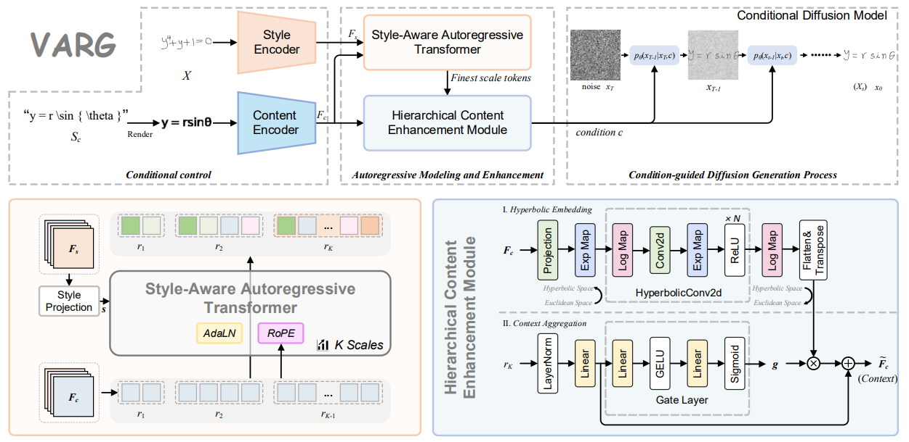
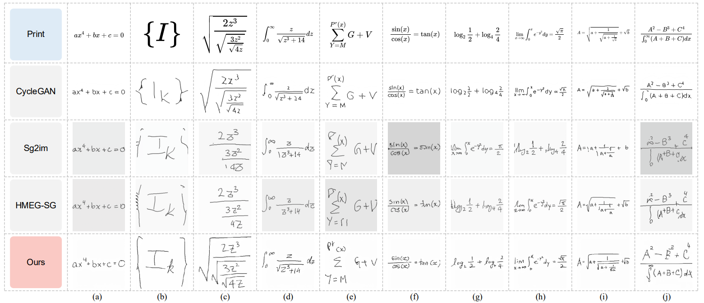

<h1 align="center">Visual Autoregressive Modeling for Handwritten Mathematical Expression Generation</h1>

# ⭐️ contribution
- We propose a novel framework for HMEG, termed VARG, which effectively models the spatial structure of expressions while preserving handwriting style. To the best of our knowledge, this is the first HMEG method to introduce a visual autoregressive generation mechanism.
- We propose SAT, which progressively models content representations under the guidance of style conditions.
- We propose a HCEM that captures the inherent hierarchical relationships within expression content via a HEU, and employs a CAM with gated mechanism to dynamically suppress redundant features and enhance structural consistency in content representation.
- Extensive experiments on benchmark datasets demonstrate that VARG outperforms state-of-the-art models across four evaluation metrics. Furthermore, we show that the HME images synthesized by VARG can significantly improve downstream HMER performance when used as data augmentation.

  

<b>Overview of the proposed VARG</b>

# 📝 Datasets

We use CROHME14/16/19 dataset.

# 🔥 Train

<code>
  CUDA_VISIBLE_DEVICES=0,1,2,3 train.py
</code>

# 📈 Comparison with other methods

  

# 📌 ACK.
Thanks to the open source guys.

# More details will be updated soon.
