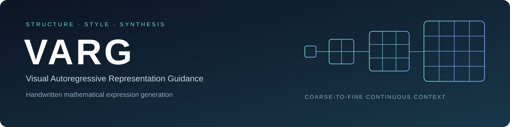
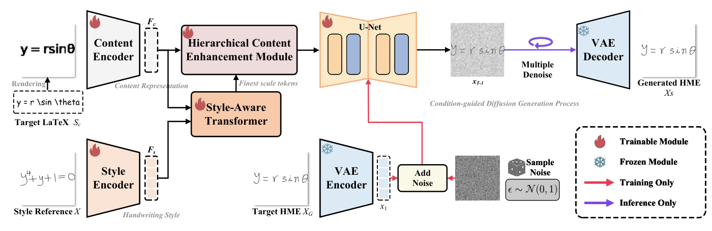
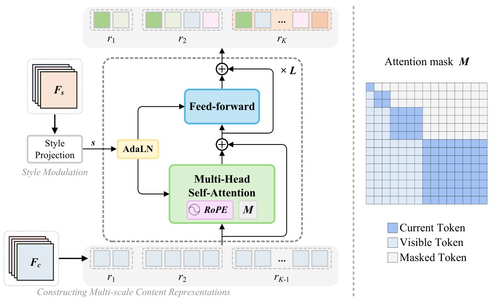
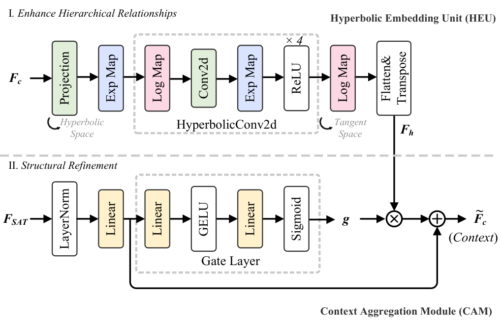

<div align="center">



# VARG

### Structure-Aware Handwritten Mathematical Expression Generation<br>with Visual Autoregressive Representation Guidance


[Overview](#overview) · [Architecture](#architecture) · [Quick start](#quick-start) · [Results](#manuscript-results) · [Repository](#repository-map)

</div>

## Overview

VARG synthesizes handwritten mathematical expressions from a **rendered content image** and a **reference handwriting image**. It combines coarse-to-fine, style-aware visual representation guidance with conditional latent diffusion to preserve two-dimensional expression structure and handwriting appearance.

The autoregressive component operates on **continuous multiscale representations**, not discrete image tokens. The final image is produced by a diffusion U-Net and a frozen VAE decoder; VARG is not an autoregressive image decoder.

> This repository contains the supplied research implementation, with paper-aligned module names and cleaned interfaces. Metrics and architecture illustrations below come from the manuscript, not new runs during the interface cleanup. Datasets, trained VARG checkpoints, and evaluation recognizers are not bundled.

## Architecture

<p align="center"></p>

Separate visual encoders extract handwriting style and printed content. SAT constructs a style-conditioned representation; HCEM refines it through HEU and CAM. The resulting context conditions the diffusion denoiser through cross-attention.

| Component | Full name | Role | Implementation |
| :-- | :-- | :-- | :-- |
| SAT | Style-Aware Transformer | Style-modulated multiscale attention with AdaLN and RoPE | [fusion.py](models/fusion.py) |
| HCEM | Hierarchical Content Enhancement Module | Container for HEU and CAM | [hcem.py](models/hcem.py) |
| HEU | Hyperbolic Embedding Unit | Hyperbolic processing of content features | [heu.py](models/heu.py) |
| CAM | Context Aggregation Module | Gated residual fusion of SAT and HEU features | [hcem.py](models/hcem.py) |
| VARG | Conditional diffusion network | U-Net denoising conditioned on SAT–HCEM context | [unet.py](models/unet.py) |

<details>
<summary>Inside SAT and HCEM</summary>

<p align="center"> </p>

SAT pools content at scales **1, 2, 4, 8, 16**, creating **341 tokens**. Each token can attend to its own scale and all coarser scales. Six transformer blocks use style-conditioned AdaLN and rotary positions. The finest **256 tokens**, projected to **512 dimensions**, provide diffusion context.

The conditioner instantiates HEU with four hyperbolic convolution blocks. CAM retains `SAT_features + sigmoid(MLP(SAT_features)) * HEU_features`.

**Implementation boundary.** This release does not rewrite numerical operations. The supplied HEU uses Möbius exponential/logarithmic-map operations, whereas the manuscript describes a Lorentz-model formulation. CAM retains its existing gated residual computation rather than introducing new normalization/projection layers from the conceptual diagram. These mathematical differences are documented, not silently changed.

</details>

## Quick start

### Environment

Use Python 3.10 or newer for a fresh environment. Training requires Linux, an NVIDIA GPU, a compatible CUDA-enabled PyTorch build, and NCCL. The manuscript reports a single NVIDIA V100 with 32 GB memory.

```bash
git clone https://github.com/Fyzjym/VARG.git
cd VARG
python -m venv .venv
source .venv/bin/activate
# Install the CUDA-enabled torch/torchvision pair appropriate for your machine first.
python -m pip install -r requirements.txt
```

The requirements target PyTorch 2.4 / torchvision 0.19. Choose the appropriate CUDA distribution for your machine. CPU interface tests do not require CUDA.

### Prepare and train

Provide a local Stable Diffusion v1.5 directory containing `vae/`. VARG loads only `AutoencoderKL` and freezes it; this is **not** a pretrained VARG checkpoint.

Prepare your images and annotations, then update [configs/crohme.yaml](configs/crohme.yaml). `DATA_LOADER.VALIDATION_CONTENT` must point to an existing rendered expression image.

```bash
CUDA_VISIBLE_DEVICES=0 torchrun --standalone --nproc_per_node=1 train.py \
  --config configs/crohme.yaml \
  --vae-path /path/to/stable-diffusion-v1-5 \
  --run-name crohme-varg
```

The entry point initializes distributed training even for one GPU; use `torchrun`, not bare `python train.py`. The device is selected using `LOCAL_RANK`.

| Setting | Example configuration |
| :-- | :-- |
| Image canvas | 256 × 256 |
| Batch size | 32 per process; 32 total with one GPU |
| Optimizer / learning rate | AdamW / 1 × 10⁻⁴ |
| Epochs | 700 |
| Diffusion | 1,000 steps; linear β from 10⁻⁴ to 0.02 |
| Validation sampler | DDIM, 50 steps |
| Objective | Diffusion MSE + writer-supervised style contrastive loss |

These main settings follow the manuscript; the example is not a guarantee of numerical reproduction. Multi-GPU total batch size equals configured batch size × process count. `SOLVER.GRAD_L2_CLIP` applies only to the existing auxiliary fine-tuning branch, not the main training path.

```text
Saved/crohme/<run-name>-<timestamp>/
├── model/       # <zero-based-epoch>-ckpt.pt
├── sample/      # validation grids
└── tboard/      # loss events
```

The example saves and validates every 25 epochs. `--checkpoint /path/to/ckpt.pt` loads model weights, not optimizer state or epoch progress. `--encoder-checkpoint` optionally loads a separate ResNet-18 style-encoder state dictionary.

## Manuscript results

**CROHME 2019 — Table 1.** ExpRate uses PosFormer; the last column uses Qwen2.5-VL-7B-Instruct. These are reported numbers, not newly reproduced results.

| FID ↓ | SSIM ↑ | HWD ↓ | ExpRate ↑ | ExpRate<sub>Qwen</sub> ↑ |
| :--: | :--: | :--: | :--: | :--: |
| 5.58 | 0.906 | 0.1459 | 34.31% | 26.71% |

**Cross-dataset evaluation — Table 9.** Training uses CROHME only.

| Dataset | FID ↓ | HWD ↓ | ExpRate ↑ |
| :-- | :--: | :--: | :--: |
| UniMER-HWE | 22.21 | 0.6591 | 10.46% |
| HME100K | 36.96 | 0.7724 | 11.73% |

Adding 2,000 synthetic expressions **together with scale augmentation** yields PosFormer ExpRate of 62.54%, 63.46%, and 63.80% on CROHME 2014/2016/2019 (Table 10). Those values describe the combined setting, not synthesis alone. Evaluation extractors and downstream recognizer training are outside this release.

## Repository map

```text
VARG/
├── assets/                 # README artwork and manuscript figures
├── configs/crohme.yaml     # editable training example
├── data_loader/loader.py   # HME targets, references, content adapters
├── models/
│   ├── fusion.py           # SAT and VARGConditioner
│   ├── hcem.py             # HCEM and CAM
│   ├── heu.py              # HEU and hyperbolic operations
│   ├── unet.py             # VARG diffusion network
│   ├── diffusion.py        # schedule, DDIM/DDPM samplers
│   └── loss.py             # supervised contrastive objective
├── trainer/trainer.py      # training, validation, checkpoints
├── tests/                  # CPU interface tests
├── utils/checkpoint.py     # checkpoint-name compatibility
├── parse_config.py         # YAML configuration loader
├── requirements.txt
└── train.py                # torchrun entry point
```

Run `python -m unittest discover -s tests -v` for interface tests. They do not replace full GPU training or generation-quality evaluation. The auxiliary OCR fine-tuning branch is not used by the supplied command and was not refactored in this release.
